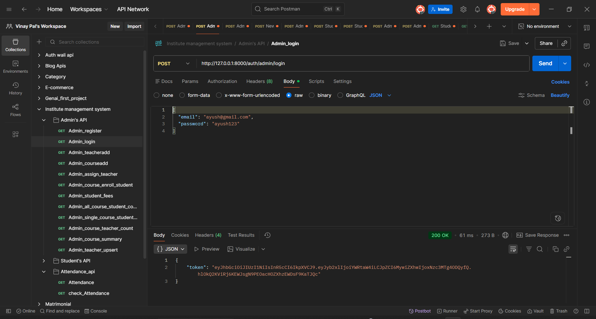
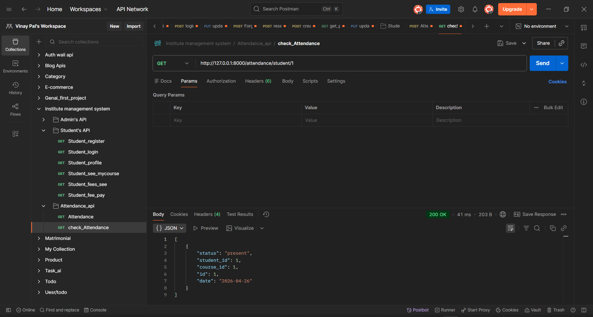

# 🚀 Institute Management System

A full-stack backend project built using **FastAPI** and **PostgreSQL**, designed to manage students, courses, attendance, and fees with secure authentication.

---

## 🔥 Features

* 🔐 JWT Authentication (Admin & Student)
* 👥 Role-Based Access Control (RBAC)
* 🎓 Student & Course Management
* 📝 Attendance Tracking System
* 💰 Fee Management System
* 📧 Email Notification on Registration
* 📡 RESTful APIs tested using Postman

---

## 🛠️ Tech Stack

* **Backend:** FastAPI
* **Database:** PostgreSQL
* **ORM:** SQLAlchemy
* **Authentication:** JWT (JSON Web Token)
* **Email Service:** FastAPI-Mail
* **API Testing:** Postman

---

## 📌 API Documentation

Swagger UI available at:

http://127.0.0.1:8000/docs

---

## ⚙️ Setup Instructions

### 1️⃣ Clone the Repository

```bash
git clone https://github.com/vinaypal31/institute-management-system.git
cd institute-management-system
```

---

### 2️⃣ Create `.env` File

```env
DATABASE_URL=your_database_url
SECRET_KEY=your_secret_key
MAIL_USERNAME=your_email@gmail.com
MAIL_PASSWORD=your_app_password
```

---

### 3️⃣ Install Dependencies

```bash
pip install -r requirements.txt
```

---

### 4️⃣ Run the Server

```bash
uvicorn main:app --reload
```

---

## 📬 API Testing

All APIs have been tested using Postman.

Postman Collection is included in the repository.

---

## 📸 Screenshots

### 🔑 Login API



### 📝 Attendance API


---

## 🧠 Project Highlights

* Implemented **secure authentication** using JWT with token expiry
* Designed **role-based access control** for admin and student
* Built **modular architecture** (auth, institute, attendance)
* Created real-world features like **fees and attendance tracking**
* Integrated **email notifications** for user registration

---

## 🚀 Future Improvements

* 📊 Attendance analytics dashboard
* 📱 Full React frontend
* 🔄 Refresh token system
* 📈 Admin reporting system

---

## 👨‍💻 Author

**Vinay Pal**

---

## ⭐ If you like this project

Give it a ⭐ on GitHub and share your feedback!
